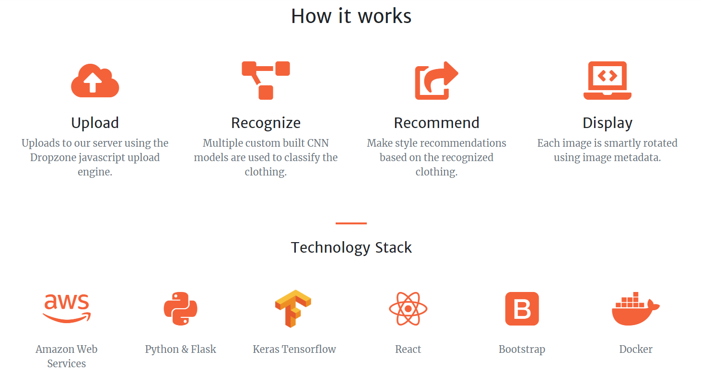

# Sense Fashion

Sense Fashion is an automatic labeling system for fashion online retailers deployed as a full-stack web application. Sense Fashion can readily identify fashion items due to its ability to label based on pre-trained generalized attributes. Specific identified attributes can further be categorized as styles of clothing where further user recommendations can be made.

# Try it out here:

## ABOUT:

This Python/Flask web application hosted on AWS using a docker container allows a user to upload images that will then be identified using customized neural network models pretrained exclusively on fashion data. Sense-fashion uses a combination of 3 different customized Tensorflow models to label the clothing item and was able to achieve a higher accuracy than UCLA's [FashionNet](https://www.groundai.com/project/fashionnet-personalized-outfit-recommendation-with-deep-neural-network/1) on certain attributes. If the image matches a specific style-set of clothing, recommendations are sent to the user along with an identified label.

## MODEL TRAINING PROCESS:

#### 1. Data Preprocessing

Researched the business case. Read academic papers referring us to DeepFashion data and FashionNet model. Manually cleaned folders from DeepFashion and sorted according to one feature (print, fabric, clothing type).

#### 2. Model Benchmark

Used VGG model pretrained on Imagenet with transfer learning; changing the output layer to include: 11 patterns, 10 fabrics and  17 clothing types. In total we used 150 images per class. 

#### 3. Improving Accuracy

Increased data to 1000 images per class. Classes decreased to: 9 pattern, 8 fabric, and 12 clothing items. Increased epochs and decreased learning rate until our models achieved the desired accuracy.

#### 4. Finalizing Model

Employ data augmentation techniques such as rotation, brightness, zoom, and size to address overfitting.  Increased accuracy to a desirable > 60%.

#### 5. Comparing SenseFashion vs UCLA's FashionNet

FashionNet trained exclusively on DeepFashion data and used VGG 16 algorithm. Fashion Sense had a higher accuracy due to extensive data preprocessing work.
